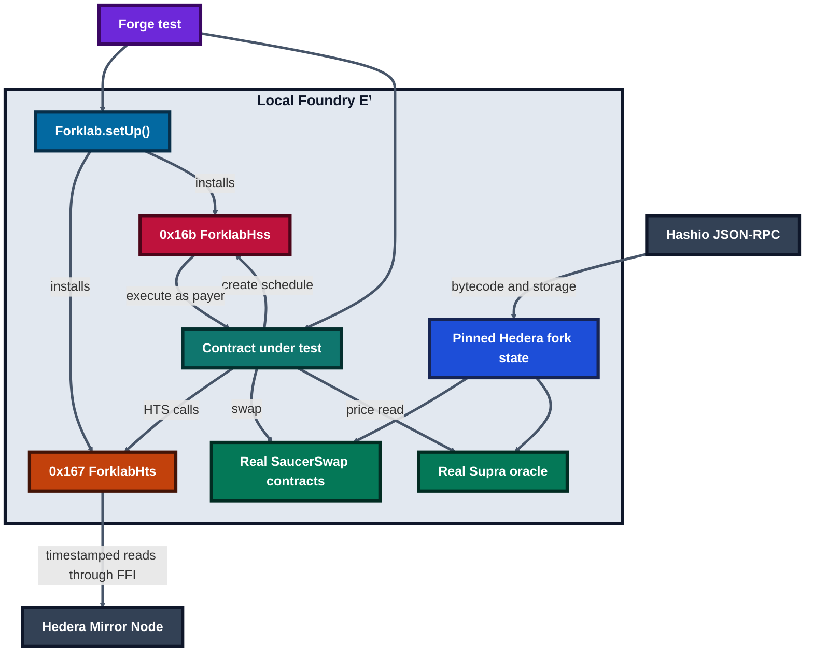

# Forklab

Test against real Hedera locally, including the Hedera Schedule Service. Forklab is a Scaffold-HBAR template for Foundry tests that keep HTS token state, SaucerSwap, Supra, the Mirror Node, and scheduled contract calls in the same workflow.

The local emulator is a test aid, not a replacement for testnet. Fork tests read real Hedera state at a pinned block. A live `RecurringBuy` deployment is recorded in [`docs/TESTNET_PROOF.md`](docs/TESTNET_PROOF.md). Its first scheduled run failed: the Mirror Node trace shows the swap and owner transfer succeeding, then the re-schedule running out of gas inside a 1,500,000 limit. After the contract and the emulator were fixed for that cause, a fresh vault (`0.0.10861899`) completed two consecutive HSS-triggered purchases on testnet, each using about 1.68M of its 2.5M gas limit.

## Prerequisites

- Node.js `>=20.18.3`
- Yarn `3.2.3` or npm
- Foundry `v1.5.0` (`forge`, `cast`, and `anvil`)
- `bash` and `curl` on `PATH` (macOS, Linux, or WSL)
- A funded Hedera account is required only for testnet deployment

Foundry v1.5.0 is pinned because Hashio currently rejects the EIP-1898 block-object request sent by newer Foundry versions. `cast` is also required because the HTS Mirror Node adapter invokes it through Foundry FFI.

## Quickstart

Create a project from the published template:

```bash
npm create scaffold-hbar@latest -- --template jennycruzy/scaffold-hbar-forklab
cd scaffold-hbar-forklab
npm install
npm run foundry:doctor
npm run foundry:test
npm run foundry:test:fork
npm run next:dev
```

With the repository checkout, use the equivalent Yarn commands:

```bash
node .yarn/releases/yarn-3.2.3.cjs install
node .yarn/releases/yarn-3.2.3.cjs foundry:doctor
node .yarn/releases/yarn-3.2.3.cjs foundry:test
node .yarn/releases/yarn-3.2.3.cjs foundry:test:testnet-fork
node packages/foundry/scripts-js/probeScheduleLimits.js
node .yarn/releases/yarn-3.2.3.cjs fork:mainnet
node .yarn/releases/yarn-3.2.3.cjs next:dev
```

`foundry:test` is offline and runs on chain id `31337`. `foundry:test:fork` uses the pinned mainnet block in `packages/foundry/scripts-js/forkBlocks.json`, then runs the Bonzo sweep suite on its own pre-pause pin (`bonzoMainnet`). Refresh a pin with `foundry:fork:pin` or `foundry:fork:pin:testnet`; the script only accepts a block whose Mirror Node balance snapshot matches a reference SaucerSwap pair (see "Hedera differences you will hit"). Tests that assert pinned quotes must be re-checked after a new pin. The recurring-buy suite reads Supra's real HBAR/USD push feed directly from the pinned Hedera state and needs no oracle API key.

`fork:mainnet` starts Anvil at `http://127.0.0.1:8545` through Hedera's `jsonRPCForwarder`, pins block `100579000`, and installs the current `ForklabHss` bytecode at `0x16b`. Keep it running beside `next:dev`; `/lab` advances time, discovers pending HSS records, impersonates their stored payers, sends their target transactions with the stored gas limit, and settles the receipt status in HSS.

### Two-minute orientation

Read this while the first fork warms up:

1. `Forklab.setUp()` installs local HTS and schedule-service behavior around a pinned Hedera snapshot.
2. Integration tests still call the real Supra feed, SaucerSwap contracts, token state, and timestamp-bounded Mirror Node data.
3. `Forklab.warp(seconds)` advances local time and executes due schedules with their recorded payer, value, gas limit, and order.
4. For an interactive run, keep `fork:mainnet` open, start the frontend, and use `/lab` to fast-forward and inspect the resulting status.

The emulator is for deterministic development; live testnet proof remains the final check for consensus behavior.

### Oracle choice

Forklab intentionally uses Supra rather than the Pyth integration named in the original specification. Since 26 August 2026, [Pyth Hermes requires an API key](https://docs.pyth.network/price-feeds/core/upgrade/preparing), with a free trial and paid plans for continued use. Supra pair `432` is an on-chain HBAR/USD push feed that can be read without an API credential. Supra, not the test, publishes that value: fork tests read the real observation already present at the pinned block instead of updating or replacing the oracle. Supra documents a one-hour push frequency on both Hedera networks, so new configurations should use the contract's two-hour `DEFAULT_MAX_PRICE_AGE` unless a measured feed interval justifies another value.

Pair `432` is HBAR/USD, so `RecurringBuy` values one unit of `tokenOut` at one US dollar. Use a USD-pegged token. For any other token, every run skips for deviation, or, with a very wide deviation setting, the swap loses its slippage floor.

## Architecture



Hashio supplies the pinned EVM state and deployed contract code. HTS calls are
handled by Forklab at `0x167`, with timestamped token and account data read from
the Mirror Node. Schedule calls are handled locally at `0x16b`, where Forklab
executes due calls with the recorded payer, value, gas limit, and ordering.

## Environment variables

| Name                                    | Required | Default                                 | Example                         |
| --------------------------------------- | -------- | --------------------------------------- | ------------------------------- |
| `HEDERA_MAINNET_RPC_URL`                | No       | `https://mainnet.hashio.io/api`         | `https://mainnet.hashio.io/api` |
| `HEDERA_TESTNET_RPC_URL`                | No       | `https://testnet.hashio.io/api`         | `https://testnet.hashio.io/api` |
| `FORK_RETRIES`                          | No       | `3`                                     | `5`                             |
| `FORK_RETRY_BACKOFF`                    | No       | `1000` ms                               | `2000`                          |
| `NEXT_PUBLIC_HEDERA_MAINNET_RPC_URL`    | No       | Hashio mainnet URL                      | `https://mainnet.hashio.io/api` |
| `NEXT_PUBLIC_HEDERA_TESTNET_RPC_URL`    | No       | Hashio testnet URL                      | `https://testnet.hashio.io/api` |
| `NEXT_PUBLIC_WALLET_CONNECT_PROJECT_ID` | No       | empty                                   | `your-project-id`               |
| `HEDERA_MIRROR_MAINNET_URL`             | No       | `https://mainnet-public.mirrornode.hedera.com` | same origin, no `/api/v1` |
| `HEDERA_MIRROR_TESTNET_URL`             | No       | `https://testnet.mirrornode.hedera.com` | same origin, no `/api/v1`       |
| `FORKLAB_LOCAL_RPC_URL`                 | No       | `http://127.0.0.1:8545`                 | `http://127.0.0.1:8546`         |
| `NEXT_PUBLIC_RECURRING_BUY_ADDRESS`     | No       | empty                                   | vault EVM address               |
| `NEXT_PUBLIC_RECURRING_BUY_FACTORY_ADDRESS` | No   | `deployedContracts.ts` entry            | factory EVM address             |
| `FORKLAB_MIRROR_LOG_URLS`               | No       | `false`                                 | `true`                          |
| `LOCALHOST_KEYSTORE_ACCOUNT`            | No       | `scaffold-hbar-default`                 | `my-testnet-account`            |

Do not commit `.env` files, private keys, or keystores.

The Solidity fork adapter, the `/lab` launcher, and the Next.js server all read the `HEDERA_MIRROR_*_URL` origins and append `/api/v1/` themselves. Set `FORKLAB_MIRROR_LOG_URLS=true` to print every Solidity adapter URL while diagnosing snapshot mismatches; URL logging is off by default.

## Fork timing

The audit's first mainnet run took 4m29s for the original 11 fork tests at block `100579000`. On 3 October 2026, a warm-cache run of the expanded six-suite command took 2m40s (`real 160.01`): 31 passed, 0 failed, 0 skipped. The suite grew between measurements, so these are reproducible operational timings rather than a like-for-like benchmark.

## Deploy and start a testnet vault

The default deploy script deploys `RecurringBuy` and `RecurringBuyFactory` with the verified Hedera testnet Supra and SaucerSwap addresses, and writes both to `packages/nextjs/contracts/deployedContracts.ts`. Use a funded ECDSA keystore that you control:

```bash
node .yarn/releases/yarn-3.2.3.cjs foundry:deploy --network hedera_testnet --keystore "$KEYSTORE_NAME"
```

Before `start()`, the owner associates with `tokenOut` and approves the vault for one base unit. Both must be direct transactions from the owner account: HRC-719 `isAssociated()` checks `msg.sender`, so the vault cannot query another account's association, and reads the owner's approval instead. This approval proves only that the owner signed an approve on the token; whether Hedera rejects `approve` from an unassociated account has not yet been confirmed on testnet.

```bash
cast send --rpc-url https://testnet.hashio.io/api --account "$KEYSTORE_NAME" --legacy "$TOKEN_OUT" 'associate()'
cast send --rpc-url https://testnet.hashio.io/api --account "$KEYSTORE_NAME" --legacy "$TOKEN_OUT" 'approve(address,uint256)' "$VAULT" 1
```

Then configure, fund, and start with the Forge script. `RECURRING_BUY_VAULT` is required; the other values have defaults:

```bash
export RECURRING_BUY_VAULT=0x...                 # required
# export RECURRING_BUY_TOKEN_OUT=0x000000000000000000000000000000000042E926
# export RECURRING_BUY_DEVIATION_BPS=10000
# export RECURRING_BUY_EXECUTION_GAS=2500000
# export RECURRING_BUY_FUND_WEIBARS=15000000000000000000   # 15 HBAR

cd packages/foundry
forge script script/ConfigureAndStartRecurringBuy.s.sol \
  --rpc-url https://testnet.hashio.io/api \
  --account "$KEYSTORE_NAME" --broadcast --slow --legacy
```

Funding: each run reserves gas at the full limit (`2,500,000 × 83` tinybars = 2.075 HBAR at the 4 October 2026 testnet price), pays the gas it actually uses (the measured schedule creation alone is 1,409,649 gas), and spends `amountPerBuy`. Payable JSON-RPC values are weibars (`1 tinybar = 10^10 weibars`); `configure` takes tinybars.

The default token is `USDC Sirio Test` (`0.0.4385062`), not production USDC. Its testnet V1 pool is far from Supra's HBAR price, so the script's default deviation is the maximum `10000` basis points, which also removes the slippage floor. That setting exists only to exercise real schedule execution on testnet; it is not a production risk setting.

The `/vault` page runs the same flow in a browser: create a vault through the factory, associate, approve, configure, fund, start, stop, and withdraw.

## Write your first scheduled-call test

This sample is kept as a real test in `packages/foundry/test/FirstScheduledCall.t.sol`, so it always compiles:

```solidity
import { Test } from "forge-std/Test.sol";
import { Forklab } from "../contracts/forklab/Forklab.sol";
import { IHederaScheduleService } from "../contracts/forklab/IHederaScheduleService.sol";

contract Counter {
    uint256 public value;

    function increment() external {
        value++;
    }
}

contract FirstScheduledCallTest is Test {
    function test_scheduledCallRuns() external {
        Forklab.setUp();
        Counter counter = new Counter();
        // This test contract is the payer, so it must hold HBAR for gas at the limit.
        vm.deal(address(this), 100_000_000);

        (int64 code, address id) = IHederaScheduleService(address(0x16b))
            .scheduleCall(address(counter), block.timestamp + 60, 100_000, 0, abi.encodeCall(Counter.increment, ()));

        assertEq(code, 22);
        assertTrue(id != address(0));
        assertEq(Forklab.warp(60), 1);
        assertEq(counter.value(), 1);
    }
}
```

## Hedera differences you will hit

- HTS token addresses can expose EIP-7702-style delegation code. `Forklab.useTokens` restores the HIP-719 proxy only for affected tokens.
- SaucerSwap V1 still uses legacy HTS mint and burn selectors. `ForklabHts` translates those selectors while retaining the supply-key checks.
- Mirror Node responses are timestamp-bounded to the pinned fork block, but token balances come from periodic Mirror Node snapshots. If a pair swapped after the last snapshot before the pin, its reserves and emulated balances disagree and swaps revert with `K`. `fork:pin` only accepts blocks where they agree.
- Creating a schedule from a contract is expensive on Hedera: `scheduleCall` used 1,409,649 gas on testnet. `ForklabHss` charges that gas (`Forklab.setScheduleCreateGas`) and fails the calling frame when it cannot be paid, as the real call did with `INSUFFICIENT_GAS`.
- Scheduled execution reserves gas at the full limit from the payer and charges the gas used at 83 tinybars per gas (`Forklab.setGasPriceTinybars`), the testnet ContractCall price on 4 October 2026.
- A marked proxy that schedules from a delegated implementation frame is created normally, then records status `7` at execution without calling its target. Mark it with `Forklab.markDelegateScheduler(proxy, true)` in a test.
- EVM HBAR values are tinybars (`1 HBAR = 100_000_000`). HSS `value` is also tinybars; JSON-RPC relay values use weibars.
- A scheduled payer must hold the call value plus the gas reservation, or the run records status `10`.
- A failed target call keeps its `value` with the payer but still pays for the gas it used.
- `RecurringBuy` schedules its next run before buying and runs the purchase in a guarded self-call, so a failed swap, transfer, or Bonzo deposit emits `PurchaseFailed` without ending the schedule chain.
- `maxDeviationBps` is currently used for both pool/oracle deviation and swap slippage; configure it for the stricter of those two limits.
- `withdraw` is disabled while a vault is running so the owner cannot starve already-planned purchases.
- Until the live testnet expiry probe is complete, an unsigned schedule that expires records status `7` as an explicit emulator choice, not a verified network claim.

## What the emulator does not do

- It does not replace consensus ordering, node throttles, or cryptographic payer signatures. Due schedules run in expiry order, then creation order.
- Per-second capacity on Hedera is a 1:10 fraction of the live throttle definitions. The emulator's 10 schedules and 15,000,000 gas per second are configurable approximations, not network values.
- It does not re-price HTS calls. Emulated token calls cost their EVM execution gas, which differs from Hedera's system-contract pricing (an HTS transfer is 15,284 gas on testnet; `associateToken` is 705,424). Measure final gas limits on testnet.
- `/lab` (Anvil) settles schedules through an external runner, so the emulator's gas fees are not charged there.
- It does not make an unsupported external protocol work.
- It does not provide fake routers, pools, tokens, or oracle responses.
- It does not make Mirror Node data available at a precision the service cannot return.
- The live testnet deployment and its independently checked Mirror Node records are documented in [`docs/TESTNET_PROOF.md`](docs/TESTNET_PROOF.md). Scheduled-run evidence is added there only after each transaction succeeds.
- It cannot infer an earlier delegatecall from the ordinary call frame received by `0x16b`; proxy scheduling must be opted in with `Forklab.markDelegateScheduler`.
- It does not protect configuration setters. Any contract on the fork can change emulator limits, fees, delegate markers, and rule settings because Forklab is a test tool.
- Anvil mode cannot install per-schedule delete redirect bytecode because that uses Foundry cheatcodes. Use `deleteSchedule(address)` there; schedule-address redirects remain enabled and tested in Forge.

## Troubleshooting

| Symptom                                                  | Fix                                                                                                              |
| -------------------------------------------------------- | ---------------------------------------------------------------------------------------------------------------- |
| Forge fork request returns HTTP 400 about a block object | Install Foundry `v1.5.0`, then run `foundry:doctor`.                                                             |
| HTS reads return empty bytes                             | Put `cast` on `PATH`; the Mirror Node adapter uses it through FFI.                                               |
| FFI cannot run                                           | Install `bash` and `curl`, enable `ffi` in `foundry.toml`, and pass `--ffi`.                                     |
| A token call reports an unsupported selector             | Call `Forklab.useTokens` for every token used by the test.                                                       |
| A swap reverts with `K`                                  | Re-pin with `fork:pin`, which checks the Mirror Node balance snapshot against pair reserves; never edit pair storage. |
| A scheduled run fails with `INSUFFICIENT_GAS`            | Raise the gas limit: creating the next schedule alone costs about 1.41M gas on Hedera.                           |
| A scheduled call fails after delegatecall                | Schedule from the concrete contract frame, not a proxy or delegatecall library.                                  |
| A scheduled call stops without a target event            | Check the payer HBAR balance and schedule status.                                                                |
| A recurring buy skips with a stale oracle price          | Check Supra pair `432` at the pinned block and increase `maxPriceAge` only when the feed timestamp justifies it. |

## Integrations

The implemented fork examples are SaucerSwap V1 swaps, Supra HBAR/USD push-feed reads, HTS token reads, the Hedera Schedule Service emulator, and the owner-controlled Bonzo Lend sweep. Their fork tests read real network state.

Bonzo's mainnet LendingPool has been paused since block `97,506,158`; `deposit` returns Aave v2 error `"64"` (`LP_IS_PAUSED`). `test/fork/BonzoSweepMainnet.t.sol` therefore runs on a separate pin just before the pause, block `97,505,850`, where a scheduled run buys 70,640 USDC base units on SaucerSwap and deposits them into Bonzo for the owner, minting the matching aUSDC. At the main pin, a test asserts the paused pool, the `PurchaseFailed` event, and that the schedule continues. The testnet pool is not paused, but its only USD reserve has a SaucerSwap price over 2,000% away from Supra, so the vault correctly skips every run there and no testnet sweep is claimed.

## Payments-scheduler compatibility

Hedera's `templates/payments-scheduler` tests its `ScheduledVault` by etching a `MockHederaScheduleService` at `0x16b`. That mock only records the last call, and the tests call `executeScheduled()` themselves. Forklab vendors the unchanged upstream `ScheduledVault` (commit `5bda786`, MIT, under `test/compat/upstream/`) and runs the same scenarios through the emulator in `test/compat/PaymentsSchedulerCompat.t.sol`:

| Scenario                         | Upstream mock                                  | Forklab                                                                 |
| -------------------------------- | ---------------------------------------------- | ----------------------------------------------------------------------- |
| `scheduleNextRun`                | stores `lastScheduleTo` and gas                | creates a schedule; asserts payer, expiry, gas, and calldata            |
| Execution                        | the test calls `executeScheduled()` directly   | `Forklab.warp` executes it as the vault at expiry and pays its gas      |
| Reschedule                       | returns a new fake address                     | the next schedule exists and executes one interval later                |
| `cancelNextSchedule`/`configure` | stores `lastDeletedSchedule`                   | the schedule is deleted and never executes                              |
| No capacity                      | `setHasCapacity(false)`                        | the expiry second is actually full                                      |
| Max consecutive failures         | could not observe the stop                     | no schedule remains after the second failure                            |
| Unfunded vault                   | not representable                              | the run records `INSUFFICIENT_PAYER_BALANCE` (10)                       |

## Evidence and credits

- Verified commands and network values: [`docs/VERIFIED.md`](docs/VERIFIED.md)
- Testnet deployment and transaction evidence: [`docs/TESTNET_PROOF.md`](docs/TESTNET_PROOF.md). The document distinguishes deployment from scheduled-run evidence.
- Agent extension rules: [`AGENTS.md`](AGENTS.md)
- Scaffold-HBAR and Hedera tooling: [Scaffold HBAR](https://github.com/hedera-dev/scaffold-hbar). `ScheduledVault` and its strategy interfaces are vendored from its `templates/payments-scheduler` branch under the MIT licence.
- Forking library: [hedera-forking](https://github.com/hashgraph/hedera-forking)
