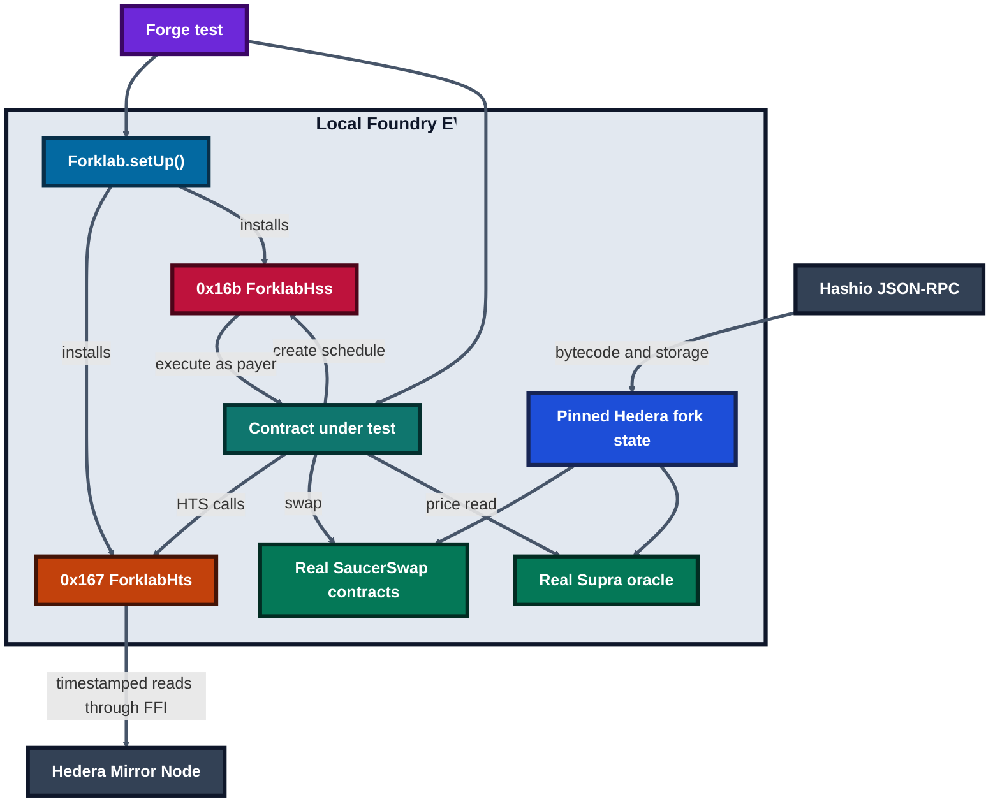

# Forklab

Test against real Hedera locally, including the Hedera Schedule Service. Forklab is a Scaffold-HBAR template for Foundry tests that keep HTS token state, SaucerSwap, Supra, the Mirror Node, and scheduled contract calls in the same workflow.

The local emulator is a test aid, not a replacement for testnet. Fork tests read real Hedera state at a pinned block. A live testnet deployment and its transaction evidence have not yet been completed.

## Prerequisites

- Node.js `>=20.18.3`
- Yarn `3.2.3` or npm
- Foundry `v1.5.0` (`forge`, `cast`, and `anvil`)
- `bash` and `curl` on `PATH` (macOS, Linux, or WSL)
- A funded Hedera account is required only for testnet deployment

Foundry v1.5.0 is pinned because Hashio currently rejects the EIP-1898 block-object request sent by newer Foundry versions. `cast` is also required because the HTS Mirror Node adapter invokes it through Foundry FFI.

## Quickstart

Create a project from the published template:

```bash
npm create scaffold-hbar@latest -- --template jennycruzy/scaffold-hbar-forklab
cd scaffold-hbar-forklab
npm install
npm run foundry:doctor
npm run foundry:test
npm run foundry:test:fork
npm run next:dev
```

With the repository checkout, use the equivalent Yarn commands:

```bash
node .yarn/releases/yarn-3.2.3.cjs install
node .yarn/releases/yarn-3.2.3.cjs foundry:doctor
node .yarn/releases/yarn-3.2.3.cjs foundry:test
node .yarn/releases/yarn-3.2.3.cjs next:dev
```

`foundry:test` is offline and runs on chain id `31337`. `foundry:test:fork` uses the pinned mainnet block in `packages/foundry/scripts-js/forkBlocks.json`; refresh it with `foundry:fork:pin` when a new snapshot is needed. The recurring-buy suite reads Supra's real HBAR/USD push feed directly from the pinned Hedera state and needs no oracle API key.

### Oracle choice

Forklab intentionally uses Supra rather than the Pyth integration named in the original specification. Since 26 August 2026, [Pyth Hermes requires an API key](https://docs.pyth.network/price-feeds/core/upgrade/preparing), with a free trial and paid plans for continued use. Supra pair `432` is an on-chain HBAR/USD push feed that can be read without an API credential. Supra, not the test, publishes that value: fork tests read the real observation already present at the pinned block instead of updating or replacing the oracle. Supra documents a one-hour push frequency on both Hedera networks, so new configurations should use the contract's two-hour `DEFAULT_MAX_PRICE_AGE` unless a measured feed interval justifies another value.

## Architecture



Hashio supplies the pinned EVM state and deployed contract code. HTS calls are
handled by Forklab at `0x167`, with timestamped token and account data read from
the Mirror Node. Schedule calls are handled locally at `0x16b`, where Forklab
executes due calls with the recorded payer, value, gas limit, and ordering.

## Environment variables

| Name | Required | Default | Example |
| --- | --- | --- | --- |
| `HEDERA_MAINNET_RPC_URL` | No | `https://mainnet.hashio.io/api` | `https://mainnet.hashio.io/api` |
| `HEDERA_TESTNET_RPC_URL` | No | `https://testnet.hashio.io/api` | `https://testnet.hashio.io/api` |
| `FORK_RETRIES` | No | `3` | `5` |
| `FORK_RETRY_BACKOFF` | No | `1000` ms | `2000` |
| `NEXT_PUBLIC_HEDERA_MAINNET_RPC_URL` | No | Hashio mainnet URL | `https://mainnet.hashio.io/api` |
| `NEXT_PUBLIC_HEDERA_TESTNET_RPC_URL` | No | Hashio testnet URL | `https://testnet.hashio.io/api` |
| `NEXT_PUBLIC_WALLET_CONNECT_PROJECT_ID` | No | empty | `your-project-id` |
| `HEDERA_MIRROR_MAINNET_URL` | No | `https://mainnet.mirrornode.hedera.com` | same URL |
| `HEDERA_MIRROR_TESTNET_URL` | No | `https://testnet.mirrornode.hedera.com` | same URL |
| `LOCALHOST_KEYSTORE_ACCOUNT` | No | `scaffold-hbar-default` | `my-testnet-account` |

Do not commit `.env` files, private keys, or keystores.

## Write your first scheduled-call test

```solidity
import {Forklab} from "../contracts/forklab/Forklab.sol";
import {IHederaScheduleService} from "../contracts/forklab/IHederaScheduleService.sol";

contract ScheduledCallTest is Test {
    function test_scheduledCallRuns() external {
        Forklab.setUp();
        Counter counter = new Counter();
        (int64 code, address id) = IHederaScheduleService(0x16b).scheduleCall(
            address(counter), block.timestamp + 60, 100_000, 0, abi.encodeCall(Counter.increment, ())
        );
        assertEq(code, 22);
        assertEq(Forklab.warp(60), 1);
        assertEq(counter.value(), 1);
        assertTrue(id != address(0));
    }
}
```

## Hedera differences you will hit

- HTS token addresses can expose EIP-7702-style delegation code. `Forklab.useTokens` restores the HIP-719 proxy only for affected tokens.
- SaucerSwap V1 still uses legacy HTS mint and burn selectors. `ForklabHts` translates those selectors while retaining the supply-key checks.
- Mirror Node responses are timestamp-bounded to the pinned fork block. Pair reserves and token balances must describe the same snapshot.
- A marked proxy that schedules from a delegated implementation frame is created normally, then records status `7` at execution without calling its target. Mark it with `Forklab.markDelegateScheduler(proxy, true)` in a test.
- EVM HBAR values are tinybars (`1 HBAR = 100_000_000`). HSS `value` is also tinybars; JSON-RPC relay values use weibars.
- A scheduled payer must keep enough HBAR for the call value and configured execution fee.
- A failed target call refunds its `value` to the payer but retains the configured execution fee.
- Until the live testnet expiry probe is complete, an unsigned schedule that expires records status `7` as an explicit emulator choice, not a verified network claim.

## What the emulator does not do

- It does not replace consensus ordering, node throttles, or cryptographic payer signatures.
- It does not make an unsupported external protocol work.
- It does not provide fake routers, pools, tokens, or oracle responses.
- It does not make Mirror Node data available at a precision the service cannot return.
- It does not prove a deployment; testnet claims belong in `docs/TESTNET_PROOF.md` with resolvable links.
- It cannot infer an earlier delegatecall from the ordinary call frame received by `0x16b`; proxy scheduling must be opted in with `Forklab.markDelegateScheduler`.
- It does not protect configuration setters. Any contract on the fork can change emulator limits, fees, delegate markers, and rule settings because Forklab is a test tool.

## Troubleshooting

| Symptom | Fix |
| --- | --- |
| Forge fork request returns HTTP 400 about a block object | Install Foundry `v1.5.0`, then run `foundry:doctor`. |
| HTS reads return empty bytes | Put `cast` on `PATH`; the Mirror Node adapter uses it through FFI. |
| FFI cannot run | Install `bash` and `curl`, enable `ffi` in `foundry.toml`, and pass `--ffi`. |
| A token call reports an unsupported selector | Call `Forklab.useTokens` for every token used by the test. |
| A swap reverts with `K` | Use a pinned block and inspect timestamp-bounded Mirror Node responses; never edit pair storage. |
| A scheduled call fails after delegatecall | Schedule from the concrete contract frame, not a proxy or delegatecall library. |
| A scheduled call stops without a target event | Check the payer HBAR balance and schedule status. |
| A recurring buy skips with a stale oracle price | Check Supra pair `432` at the pinned block and increase `maxPriceAge` only when the feed timestamp justifies it. |

## Integrations

The implemented fork examples are SaucerSwap V1 swaps, Supra HBAR/USD push-feed reads, HTS token reads, and the Hedera Schedule Service emulator. Their fork tests read real network state. The required Bonzo Lend integration has not yet been built or tested.

## Evidence and credits

- Verified commands and network values: [`docs/VERIFIED.md`](docs/VERIFIED.md)
- Testnet transaction evidence will be linked here after the live deployment and proof run are complete.
- Agent extension rules: [`AGENTS.md`](AGENTS.md)
- Scaffold-HBAR and Hedera tooling: [Scaffold HBAR](https://github.com/hedera-dev/scaffold-hbar)
- Forking library: [hedera-forking](https://github.com/hashgraph/hedera-forking)
