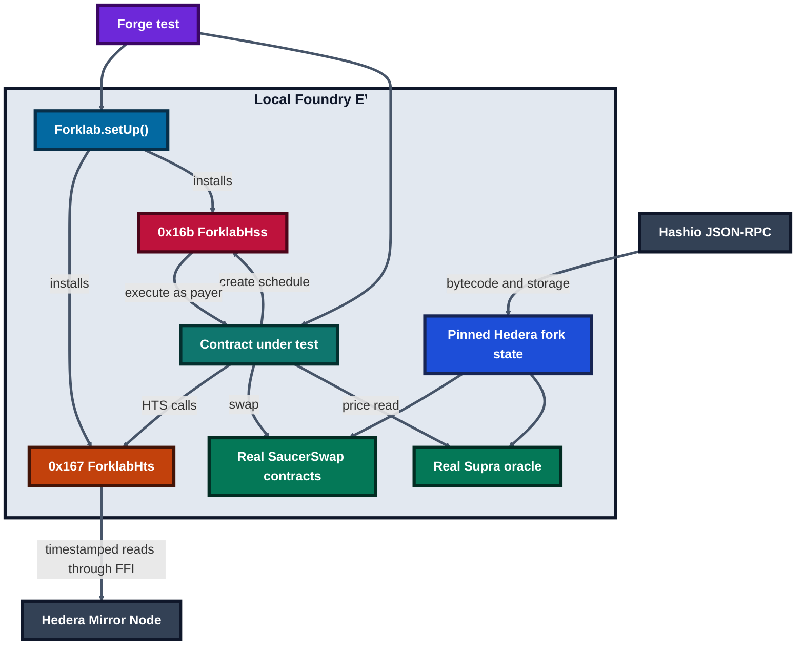

# Forklab

**Live site: [scaffold-hbar-forklab.vercel.app](https://scaffold-hbar-forklab.vercel.app)** · [emulator playground](https://scaffold-hbar-forklab.vercel.app/#playground) · [live testnet vault](https://scaffold-hbar-forklab.vercel.app/testnet)

**The Hedera Schedule Service, emulated on a fork of real Hedera.** Forklab is a Scaffold-HBAR template for Foundry. Your test schedules a call through `0x16b`, `Forklab.warp(60)` moves time forward, and the call runs as its payer, with its gas limit, Hedera's fees, and expiry order, against the real SaucerSwap pools, Supra feed, and HTS balances at a pinned block. No external system is mocked.

Contracts that schedule their own future calls (HIP-1215) are hard to test: Anvil has no schedule service, and testnet makes you wait for real time. The usual workaround is a small mock at `0x16b` that records the call, which the test then runs by hand, with no gas limit, fees, payer balance, or expiry, often next to mocked DEX and token contracts ([why that is not enough](#why-forklab-is-different)).

## Verify it in about a minute

| | What you check | How |
| --- | --- | --- |
| **No install** | The emulator's rules, interactively, and the live testnet vault | Open the [Forklab site](https://scaffold-hbar-forklab.vercel.app): the playground replays a scheduled vault under a mock and under Forklab; [`/testnet`](https://scaffold-hbar-forklab.vercel.app/testnet) reads the deployed vault from the Mirror Node |
| **No install** | Six scheduled purchases on Hedera testnet, then an empty payer | [Mirror Node: vault `0.0.10861899` transactions](https://testnet.mirrornode.hedera.com/api/v1/transactions?account.id=0.0.10861899&transactiontype=CONTRACTCALL&order=desc&limit=25) (`"scheduled": true`, six `SUCCESS`, one `INSUFFICIENT_PAYER_BALANCE`) |
| **One command** (Foundry v1.5.0 only) | The offline suite, both testnet failures reproduced on a mainnet fork, and the testnet record | `git clone --recurse-submodules https://github.com/Jennycruzy/scaffold-hbar-forklab && cd scaffold-hbar-forklab && bash verify.sh` |

`verify.sh` needs no wallet, API key, or `yarn install`. On a fresh clone it printed:

```text
1/3  Offline emulator suite (no network)
  PASS Ran 7 test suites in 1.70s (1.83s CPU time): 32 tests passed, 0 failed, 4 skipped (36 total tests)
2/3  Live-testnet failures, reproduced on mainnet block 100579000
  PASS 1.5M gas limit cannot fund the 1,409,649-gas re-schedule plus a SaucerSwap purchase
  PASS an empty vault gets INSUFFICIENT_PAYER_BALANCE and is charged 1,735,120 tinybars
3/3  Live testnet record for vault 0.0.10861899
  PASS 6 scheduled runs SUCCESS, then 1 INSUFFICIENT_PAYER_BALANCE, as the emulator predicts
All Forklab checks passed.
```

The clone took 16 seconds. The fork step fetches state from Hashio and takes about 45 seconds the first time and 2 seconds after that. No Foundry yet? `curl -L https://foundry.paradigm.xyz | bash && foundryup -i 1.5.0`.

## Why Forklab is different

A schedule-service mock answers "did my contract ask to be scheduled?" Forklab answers "will the scheduled run work on Hedera?" Those are different questions, and live testnet showed us two failures that only the second one catches:

1. **The run that ran out of gas.** Our first testnet vault scheduled its next run with a 1,500,000 gas limit. The oracle read, the SaucerSwap swap and the token transfer all worked, then creating the next schedule failed with `INSUFFICIENT_GAS`: that call alone costs 1,409,649 gas. The whole run reverted, the swap with it, and no next run existed. A recording mock never runs the call, so that test passes. Forklab charges the measured cost, and `test_testnetFailureGasLimitCannotFundRescheduleAndPurchase` reproduces the shortfall on the fork.
2. **The vault that ran dry.** Testnet vault `0.0.10861899` made six purchases, then could not pay for the seventh schedule. The network still charged it 1,735,120 tinybars. A mock has no payer balance. Forklab checks the payer before every run and charges the same fee (`test_outOfHbarRecordsPayerFailure`, `test_insufficientPayerIsChargedTheMeasuredFee`).

| What the test sees | Typical `0x16b` mock | Forklab |
| --- | --- | --- |
| The scheduled call | Recorded; the test calls the target by hand | Executed at expiry by `Forklab.warp`, as the payer |
| Gas limit and schedule-creation cost | Ignored | Enforced, with the 1,409,649 gas measured on testnet |
| Payer balance and fees | Ignored | Reserved and charged; an unfunded payer gets `INSUFFICIENT_PAYER_BALANCE` |
| Expiry order, per-second capacity, delete, signatures | A flag set by hand, if at all | Modelled, with Hedera's response codes |
| `msg.sender` inside the run | The test contract | The schedule's payer |
| SaucerSwap, Supra, HTS tokens, Bonzo | Usually mocked too | Real contracts and balances on a pinned mainnet fork |

When the network and the emulator disagree, the emulator changes. `yarn foundry:testnet:probe` asks live Hedera about edge cases; on 4 October 2026 it showed that a non-creator delete returns `7` (the emulator said `157`) and that an unsigned schedule settles at expiry as `INVALID_PAYER_SIGNATURE` (`43`) with no fee. It also showed that an `approve` from an account not associated with the token reverts with empty data. All three are now emulated and tested.

What Forklab does not model is listed in [What the emulator does not do](#what-the-emulator-does-not-do), and every number above comes from a testnet transaction recorded in [`docs/TESTNET_PROOF.md`](docs/TESTNET_PROOF.md).

## What you get

| Piece | Where |
| --- | --- |
| HSS emulator: create, sign, delete, capacity, expiry order, payer gas and fees | `contracts/forklab/ForklabHss.sol`, `Forklab.warp` |
| HTS on a fork, with association and allowances read from the Mirror Node at the pinned block | `contracts/forklab/ForklabHts.sol`, `ForklabMirrorNode.sol` |
| Fork tests against real SaucerSwap, Supra, and Bonzo Lend | `packages/foundry/test/fork/` |
| `RecurringBuy`: a vault that buys a token on SaucerSwap every interval, guarded by Supra's HBAR/USD price and rescheduled by the network itself, with a factory, deploy script, and one-command testnet start | `RecurringBuy.sol`, `yarn foundry:testnet:start` |
| `/` emulator playground, `/testnet` live vault status, `/vault` create and run a vault, `/lab` fast-forward a local fork | `packages/nextjs/app/` |
| A one-minute verification script | `verify.sh` |

## Prerequisites

- Node.js `>=20.18.3`
- Yarn `3.2.3` or npm
- Foundry `v1.5.0` (`forge`, `cast`, and `anvil`)
- `bash` and `curl` on `PATH` (macOS, Linux, or WSL)
- A funded Hedera account is required only for testnet deployment

Foundry v1.5.0 is pinned because Hashio currently rejects the EIP-1898 block-object request sent by newer Foundry versions. `cast` is also required because the HTS Mirror Node adapter invokes it through Foundry FFI.

## Quickstart

Create a project from the published template:

```bash
npm create scaffold-hbar@latest my-forklab -- --template jennycruzy/scaffold-hbar-forklab
cd my-forklab
yarn foundry:doctor        # checks Foundry v1.5.0, cast, curl, and FFI
yarn foundry:test          # offline emulator tests
yarn foundry:test:fork     # pinned mainnet fork: SaucerSwap, Supra, HTS, Bonzo
yarn next:dev              # http://localhost:3000
```

The CLI installs dependencies itself. Put `--` before `--template`, or npm keeps the flag for itself. Add
`--package-manager npm` for an npm project and use `npm run <script>` in place of `yarn <script>`.

With the repository checkout, use the equivalent Yarn commands:

```bash
node .yarn/releases/yarn-3.2.3.cjs install
node .yarn/releases/yarn-3.2.3.cjs foundry:doctor
node .yarn/releases/yarn-3.2.3.cjs foundry:test
node .yarn/releases/yarn-3.2.3.cjs foundry:test:testnet-fork
node packages/foundry/scripts-js/probeScheduleLimits.js
node .yarn/releases/yarn-3.2.3.cjs fork:mainnet
node .yarn/releases/yarn-3.2.3.cjs next:dev
```

`foundry:test` is offline and runs on chain id `31337`. `foundry:test:fork` uses the pinned mainnet block in `packages/foundry/scripts-js/forkBlocks.json`, then runs the Bonzo sweep suite on its own pre-pause pin (`bonzoMainnet`). Refresh a pin with `foundry:fork:pin` or `foundry:fork:pin:testnet`; the script only accepts a block whose Mirror Node balance snapshot matches a reference SaucerSwap pair (see "Hedera differences you will hit"). Tests that assert pinned quotes must be re-checked after a new pin. The recurring-buy suite reads Supra's real HBAR/USD push feed directly from the pinned Hedera state and needs no oracle API key.

`fork:mainnet` starts Anvil at `http://127.0.0.1:8545` through Hedera's `jsonRPCForwarder`, pins block `100579000`, and installs the current `ForklabHss` bytecode at `0x16b`. Keep it running beside `next:dev`; `/lab` advances time, discovers pending HSS records, impersonates their stored payers, sends their target transactions with the stored gas limit, and settles the receipt status in HSS.

### Two-minute orientation

Read this while the first fork warms up:

1. `Forklab.setUp()` installs local HTS and schedule-service behavior around a pinned Hedera snapshot.
2. Integration tests still call the real Supra feed, SaucerSwap contracts, token state, and timestamp-bounded Mirror Node data.
3. `Forklab.warp(seconds)` advances local time and executes due schedules with their recorded payer, value, gas limit, and order.
4. For an interactive run, keep `fork:mainnet` open, start the frontend, and use `/lab` to fast-forward and inspect the resulting status.

The emulator is for deterministic development; live testnet proof remains the final check for consensus behavior.

### Oracle choice

Forklab uses Supra rather than Pyth for the HBAR/USD price. Since 26 August 2026, [Pyth Hermes requires an API key](https://docs.pyth.network/price-feeds/core/upgrade/preparing), with a free trial and paid plans for continued use. Supra pair `432` is an on-chain HBAR/USD push feed that can be read without an API credential. Supra, not the test, publishes that value: fork tests read the real observation already present at the pinned block instead of updating or replacing the oracle. Supra documents a one-hour push frequency on both Hedera networks, so new configurations should use the contract's two-hour `DEFAULT_MAX_PRICE_AGE` unless a measured feed interval justifies another value.

Pair `432` is HBAR/USD, so `RecurringBuy` values one unit of `tokenOut` at one US dollar. Use a USD-pegged token. For any other token, every run skips for deviation, or, with a very wide deviation setting, the swap loses its slippage floor.

## Architecture



Hashio supplies the pinned EVM state and deployed contract code. HTS calls are
handled by Forklab at `0x167`, with timestamped token and account data read from
the Mirror Node. Schedule calls are handled locally at `0x16b`, where Forklab
executes due calls with the recorded payer, value, gas limit, and ordering.

## Environment variables

| Name                                    | Required | Default                                 | Example                         |
| --------------------------------------- | -------- | --------------------------------------- | ------------------------------- |
| `HEDERA_MAINNET_RPC_URL`                | No       | `https://mainnet.hashio.io/api`         | `https://mainnet.hashio.io/api` |
| `HEDERA_TESTNET_RPC_URL`                | No       | `https://testnet.hashio.io/api`         | `https://testnet.hashio.io/api` |
| `FORK_RETRIES`                          | No       | `3`                                     | `5`                             |
| `FORK_RETRY_BACKOFF`                    | No       | `1000` ms                               | `2000`                          |
| `NEXT_PUBLIC_HEDERA_MAINNET_RPC_URL`    | No       | Hashio mainnet URL                      | `https://mainnet.hashio.io/api` |
| `NEXT_PUBLIC_HEDERA_TESTNET_RPC_URL`    | No       | Hashio testnet URL                      | `https://testnet.hashio.io/api` |
| `NEXT_PUBLIC_WALLET_CONNECT_PROJECT_ID` | No       | empty                                   | `your-project-id`               |
| `HEDERA_MIRROR_MAINNET_URL`             | No       | `https://mainnet-public.mirrornode.hedera.com` | same origin, no `/api/v1` |
| `HEDERA_MIRROR_TESTNET_URL`             | No       | `https://testnet.mirrornode.hedera.com` | same origin, no `/api/v1`       |
| `FORKLAB_LOCAL_RPC_URL`                 | No       | `http://127.0.0.1:8545`                 | `http://127.0.0.1:8546`         |
| `NEXT_PUBLIC_RECURRING_BUY_ADDRESS`     | No       | empty                                   | vault EVM address               |
| `NEXT_PUBLIC_RECURRING_BUY_FACTORY_ADDRESS` | No   | `deployedContracts.ts` entry            | factory EVM address             |
| `FORKLAB_MIRROR_LOG_URLS`               | No       | `false`                                 | `true`                          |
| `LOCALHOST_KEYSTORE_ACCOUNT`            | No       | `scaffold-hbar-default`                 | `my-testnet-account`            |

Do not commit `.env` files, private keys, or keystores.

The Solidity fork adapter, the `/lab` launcher, and the Next.js server all read the `HEDERA_MIRROR_*_URL` origins and append `/api/v1/` themselves. Set `FORKLAB_MIRROR_LOG_URLS=true` to print every Solidity adapter URL while diagnosing snapshot mismatches; URL logging is off by default.

## Fork timing

The audit's first mainnet run took 4m29s for the original 11 fork tests at block `100579000`. On 3 October 2026, a warm-cache run of the expanded six-suite command took 2m40s (`real 160.01`): 31 passed, 0 failed, 0 skipped. The suite grew between measurements, so these are reproducible operational timings rather than a like-for-like benchmark.

## Deploy and start a testnet vault

The default deploy script deploys `RecurringBuy` and `RecurringBuyFactory` with the verified Hedera testnet Supra and SaucerSwap addresses, and writes both to `packages/nextjs/contracts/deployedContracts.ts`. Use a funded ECDSA keystore that you control:

```bash
node .yarn/releases/yarn-3.2.3.cjs foundry:deploy --network hedera_testnet --keystore "$KEYSTORE_NAME"
```

Then start it. One command associates the owner with `tokenOut`, approves the vault for one base unit, configures it,
sets the gas limit, funds it with 15 HBAR, calls `start()`, and watches the first two scheduled runs. It asks for the
keystore password once, skips any step that is already done, and reads the vault address from the deploy broadcast:

```bash
KEYSTORE_NAME="$KEYSTORE_NAME" node .yarn/releases/yarn-3.2.3.cjs foundry:testnet:start
```

Set `VAULT=0x...` to start a different vault. The defaults (`RECURRING_BUY_TOKEN_OUT`, `RECURRING_BUY_AMOUNT_TINYBARS`,
`RECURRING_BUY_INTERVAL_SECONDS`, `RECURRING_BUY_DEVIATION_BPS`, `RECURRING_BUY_EXECUTION_GAS`,
`RECURRING_BUY_FUND_WEIBARS`) are at the top of `packages/foundry/scripts-js/startTestnetVault.sh`.

Association and approval must come from the owner account: HRC-719 `isAssociated()` checks `msg.sender`, so the vault
cannot query another account's association and reads the owner's one-unit approval instead.

The script uses `cast send`, not `forge script`. Forge simulates a script locally before broadcasting, that simulation
has no Hedera system contracts, and `start()` (HTS association plus an HSS `scheduleCall`) reverts there with
`InvalidFEOpcode` even though it succeeds on the network.

Funding: each run reserves gas at the full limit (`2,500,000 × 83` tinybars = 2.075 HBAR at the 4 October 2026 testnet price), pays the gas it actually uses (the measured schedule creation alone is 1,409,649 gas), and spends `amountPerBuy`. Payable JSON-RPC values are weibars (`1 tinybar = 10^10 weibars`); `configure` takes tinybars.

The default token is `USDC Sirio Test` (`0.0.4385062`), not production USDC. Its testnet V1 pool is far from Supra's HBAR price, so the script's default deviation is the maximum `10000` basis points, which also removes the slippage floor. That setting exists only to exercise real schedule execution on testnet; it is not a production risk setting.

The `/vault` page runs the same flow in a browser: create a vault through the factory, associate, approve, configure, fund, start, stop, and withdraw.

## Write your first scheduled-call test

This sample is kept as a real test in `packages/foundry/test/FirstScheduledCall.t.sol`, so it always compiles:

```solidity
import { Test } from "forge-std/Test.sol";
import { Forklab } from "../contracts/forklab/Forklab.sol";
import { IHederaScheduleService } from "../contracts/forklab/IHederaScheduleService.sol";

contract Counter {
    uint256 public value;

    function increment() external {
        value++;
    }
}

contract FirstScheduledCallTest is Test {
    function test_scheduledCallRuns() external {
        Forklab.setUp();
        Counter counter = new Counter();
        // This test contract is the payer, so it must hold HBAR for gas at the limit.
        vm.deal(address(this), 100_000_000);

        (int64 code, address id) = IHederaScheduleService(address(0x16b))
            .scheduleCall(address(counter), block.timestamp + 60, 100_000, 0, abi.encodeCall(Counter.increment, ()));

        assertEq(code, 22);
        assertTrue(id != address(0));
        assertEq(Forklab.warp(60), 1);
        assertEq(counter.value(), 1);
    }
}
```

## Hedera differences you will hit

- HTS token addresses can expose EIP-7702-style delegation code. `Forklab.useTokens` installs Forklab's HIP-719 proxy at every declared token, which also replaces that code.
- SaucerSwap V1 still uses legacy HTS mint and burn selectors. `ForklabHts` translates those selectors while retaining the supply-key checks.
- Mirror Node responses are timestamp-bounded to the pinned fork block, but token balances come from periodic Mirror Node snapshots. If a pair swapped after the last snapshot before the pin, its reserves and emulated balances disagree and swaps revert with `K`. `fork:pin` only accepts blocks where they agree.
- Creating a schedule from a contract is expensive on Hedera: `scheduleCall` used 1,409,649 gas on testnet. `ForklabHss` charges that gas (`Forklab.setScheduleCreateGas`) and fails the calling frame when it cannot be paid, as the real call did with `INSUFFICIENT_GAS`.
- Scheduled execution reserves gas at the full limit from the payer and charges the gas used at 83 tinybars per gas (`Forklab.setGasPriceTinybars`), the testnet ContractCall price on 4 October 2026.
- A payer that cannot cover that reservation gets `INSUFFICIENT_PAYER_BALANCE`, the call never runs, and the payer is still charged 1,735,120 tinybars (`Forklab.setInsufficientBalanceFeeTinybars`), as schedule `0.0.10862057` was on testnet.
- A marked proxy that schedules from a delegated implementation frame is created normally, then records status `7` at execution without calling its target. Mark it with `Forklab.markDelegateScheduler(proxy, true)` in a test.
- EVM HBAR values are tinybars (`1 HBAR = 100_000_000`). HSS `value` is also tinybars; JSON-RPC relay values use weibars.
- A scheduled payer must hold the call value plus the gas reservation, or the run records status `10`.
- A failed target call keeps its `value` with the payer but still pays for the gas it used.
- `RecurringBuy` schedules its next run before buying and runs the purchase in a guarded self-call, so a failed swap, transfer, or Bonzo deposit emits `PurchaseFailed` without ending the schedule chain.
- `maxDeviationBps` is currently used for both pool/oracle deviation and swap slippage; configure it for the stricter of those two limits.
- `withdraw` is disabled while a vault is running so the owner cannot starve already-planned purchases.
- An unsigned wait-for-expiry schedule settles as `INVALID_PAYER_SIGNATURE` (`43`) with no fee, as the testnet probe showed. An unsigned `executeCallOnPayerSignature` schedule keeps status `7`, which the probe did not exercise.

## What the emulator does not do

- It does not replace consensus ordering, node throttles, or cryptographic payer signatures. Due schedules run in expiry order, then creation order.
- Per-second capacity on Hedera is a 1:10 fraction of the live throttle definitions. The emulator's 10 schedules and 15,000,000 gas per second are configurable approximations, not network values.
- It does not re-price HTS calls. Emulated token calls cost their EVM execution gas, which differs from Hedera's system-contract pricing (an HTS transfer is 15,284 gas on testnet; `associateToken` is 705,424). Measure final gas limits on testnet.
- `/lab` (Anvil) settles schedules through an external runner, so the emulator's gas fees are not charged there.
- It rejects an unassociated `approve` only on tokens passed to `Forklab.useTokens`. Those tokens get Forklab's HIP-719 proxy, which checks `isAssociated()` first; any other token keeps the upstream proxy, which allows the call. Fork-created accounts must call `Forklab.associateLocalAccount` before approving, just as they would associate on Hedera.
- It does not make an unsupported external protocol work.
- It does not provide fake routers, pools, tokens, or oracle responses.
- It does not make Mirror Node data available at a precision the service cannot return.
- The live testnet deployment and its independently checked Mirror Node records are documented in [`docs/TESTNET_PROOF.md`](docs/TESTNET_PROOF.md). Scheduled-run evidence is added there only after each transaction succeeds.
- It cannot infer an earlier delegatecall from the ordinary call frame received by `0x16b`; proxy scheduling must be opted in with `Forklab.markDelegateScheduler`.
- It does not protect configuration setters. Any contract on the fork can change emulator limits, fees, delegate markers, and rule settings because Forklab is a test tool.
- Anvil mode cannot install per-schedule delete redirect bytecode because that uses Foundry cheatcodes. Use `deleteSchedule(address)` there; schedule-address redirects remain enabled and tested in Forge.

## Troubleshooting

| Symptom                                                  | Fix                                                                                                              |
| -------------------------------------------------------- | ---------------------------------------------------------------------------------------------------------------- |
| Forge fork request returns HTTP 400 about a block object | Install Foundry `v1.5.0`, then run `foundry:doctor`.                                                             |
| HTS reads return empty bytes                             | Put `cast` on `PATH`; the Mirror Node adapter uses it through FFI.                                               |
| FFI cannot run                                           | Install `bash` and `curl`, enable `ffi` in `foundry.toml`, and pass `--ffi`.                                     |
| A token call reports an unsupported selector             | Call `Forklab.useTokens` for every token used by the test.                                                       |
| `approve` reverts with no data                           | The caller is not associated with the token, which Hedera also rejects. Call `Forklab.associateLocalAccount(token, account)` first (on Hedera, `associateToken`). |
| A swap reverts with `K`                                  | Re-pin with `fork:pin`, which checks the Mirror Node balance snapshot against pair reserves; never edit pair storage. |
| A scheduled run fails with `INSUFFICIENT_GAS`            | Raise the gas limit: creating the next schedule alone costs about 1.41M gas on Hedera.                           |
| A scheduled call fails after delegatecall                | Schedule from the concrete contract frame, not a proxy or delegatecall library.                                  |
| A scheduled call stops without a target event            | Check the payer HBAR balance and schedule status.                                                                |
| A recurring buy skips with a stale oracle price          | Check Supra pair `432` at the pinned block and increase `maxPriceAge` only when the feed timestamp justifies it. |

## Integrations

The implemented fork examples are SaucerSwap V1 swaps, Supra HBAR/USD push-feed reads, HTS token reads, the Hedera Schedule Service emulator, and the owner-controlled Bonzo Lend sweep. Their fork tests read real network state.

Bonzo's mainnet LendingPool has been paused since block `97,506,158`; `deposit` returns Aave v2 error `"64"` (`LP_IS_PAUSED`). `test/fork/BonzoSweepMainnet.t.sol` therefore runs on a separate pin just before the pause, block `97,505,850`, where a scheduled run buys 70,640 USDC base units on SaucerSwap and deposits them into Bonzo for the owner, minting the matching aUSDC. At the main pin, a test asserts the paused pool, the `PurchaseFailed` event, and that the schedule continues. The testnet pool is not paused, but its only USD reserve has a SaucerSwap price over 2,000% away from Supra, so the vault correctly skips every run there and no testnet sweep is claimed.

## Payments-scheduler compatibility

Hedera's `templates/payments-scheduler` tests its `ScheduledVault` by etching a `MockHederaScheduleService` at `0x16b`. That mock only records the last call, and the tests call `executeScheduled()` themselves. Forklab vendors the unchanged upstream `ScheduledVault` (commit `5bda786`, MIT, under `test/compat/upstream/`) and runs the same scenarios through the emulator in `test/compat/PaymentsSchedulerCompat.t.sol`:

| Scenario                         | Upstream mock                                  | Forklab                                                                 |
| -------------------------------- | ---------------------------------------------- | ----------------------------------------------------------------------- |
| `scheduleNextRun`                | stores `lastScheduleTo` and gas                | creates a schedule; asserts payer, expiry, gas, and calldata            |
| Execution                        | the test calls `executeScheduled()` directly   | `Forklab.warp` executes it as the vault at expiry and pays its gas      |
| Reschedule                       | returns a new fake address                     | the next schedule exists and executes one interval later                |
| `cancelNextSchedule`/`configure` | stores `lastDeletedSchedule`                   | the schedule is deleted and never executes                              |
| No capacity                      | `setHasCapacity(false)`                        | the expiry second is actually full                                      |
| Max consecutive failures         | could not observe the stop                     | no schedule remains after the second failure                            |
| Unfunded vault                   | not representable                              | the run records `INSUFFICIENT_PAYER_BALANCE` (10)                       |

## Evidence and credits

- Verified commands and network values: [`docs/VERIFIED.md`](docs/VERIFIED.md)
- Testnet deployment and transaction evidence: [`docs/TESTNET_PROOF.md`](docs/TESTNET_PROOF.md). The document distinguishes deployment from scheduled-run evidence.
- Agent extension rules: [`AGENTS.md`](AGENTS.md)
- Scaffold-HBAR and Hedera tooling: [Scaffold HBAR](https://github.com/hedera-dev/scaffold-hbar). `ScheduledVault` and its strategy interfaces are vendored from its `templates/payments-scheduler` branch under the MIT licence.
- Forking library: [hedera-forking](https://github.com/hashgraph/hedera-forking)
